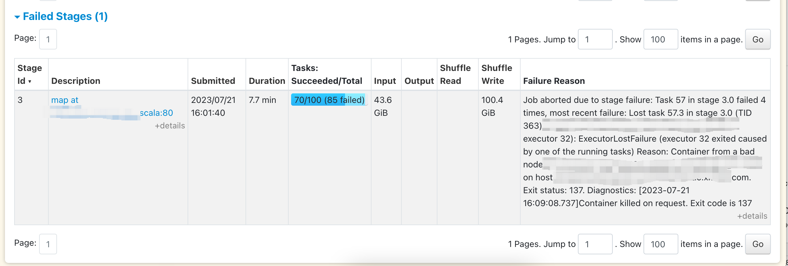
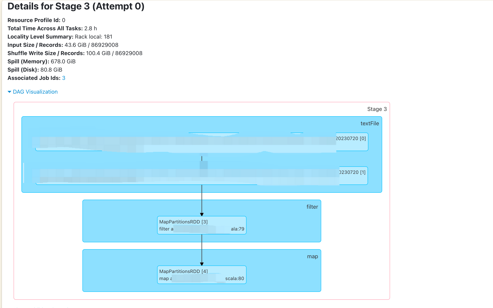
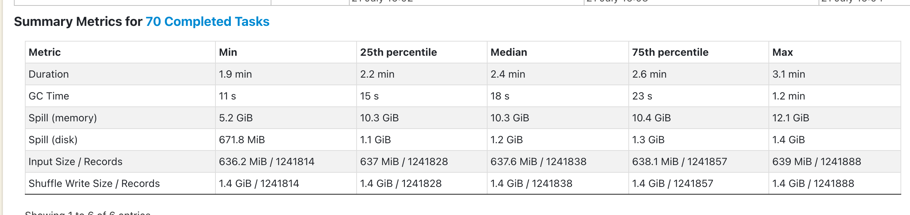
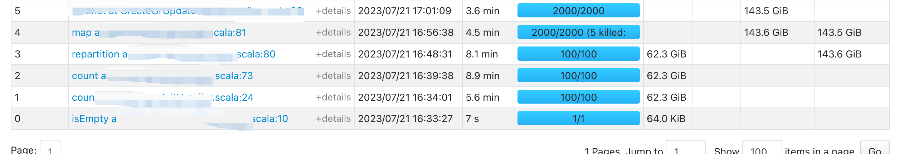
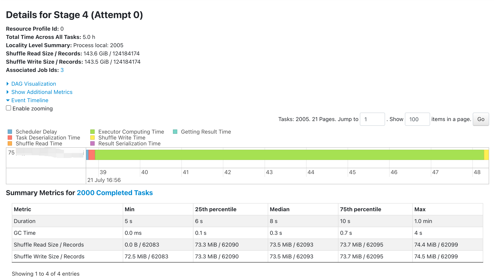

# 一次 Spark 任务 137 退出码失败原因排查
## 一、错误详情
**作业配置：** drive 10G，executor 10G，spark.dynamicAllocation.enabled=true，spark.dynamicAllocation.maxExecutors=500，
spark.default.parallelism=2000，spark.executor.heartbeatInterval=30s，Yarn 集群执行。  
**报错日志：**
「 Container from a bad node: xxxxxxxxx on host: xxxxxxxxx Exit status: 137. 
Diagnostics: [2023-07-21 16:07:00.147]Container killed on request. 
Exit code is 137 [2023-07-21 16:07:10.271]Container exited with a non-zero exit code 137. 
[2023-07-21 16:07:10.274]Killed by external signal . 」  
**失败 Stage：** 
**失败代码：**
```scala
// 在 map 算子这里失败
sc.textFile("").filter(filterFunction).map(mapFunction).reduceByKey(...)
```
## 二、错误分析与定位
**分析：**
1. 由错误日志可以知道失败节点是被 Yarn 主动 Kill 的，且是 137 退出码
2. 导致 137 退出码的失败原因一般有：内存不足、网络通信时间过长、操作系统或硬件故障等，这个任务是多次失败，更可能是前两种问题导致任务失败的
3. 输入数据大小为 63GB，原始数据文件分片为 100，该阶段并行度为 100，Task 总数为 100
4. 从 Spark UI 看失败 Stage 的汇总信息，发现 Shuffle 写和 Spill Memory 都很严重
5. 由代码知，map 和 reduceByKey 算子之间有 shuffle，map 算子 Shuffle Write 供 reduceByKey 算子 Shuffle Read
6. 观察下图发现并没有严重的数据倾斜   
  
**定位：** 结合上述 3～6 分析，判断是任务并行度 100 数量太小，导致单 Task Shuffle Write 数据量太大，执行机内存不足被 Yarn Kill，任务失败
## 三、解决措施与结果
**解决措施：** map 算子前加 repartition 算子，减小单 Task Shuffle Write 数据量
```scala
sc.textFile("").filter(filterFunction).repartition(2000).map(mapFunction).reduceByKey(...)
```
**结果：** 任务成功执行，观察 「Details for Stage 4」会发现没有内存溢出  



